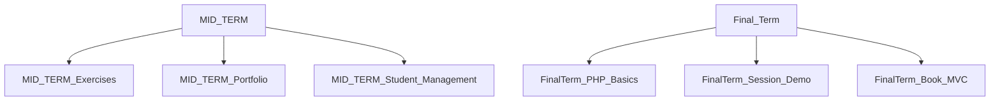

# Web_Tech

AIUB 
Course Teacher Name 
- MIRAZ ASIF MAHMUD

## Architecture / How it Works

```mermaid
flowchart TD
    MID_TERM --> MID_TERM_Exercises
    MID_TERM --> MID_TERM_Portfolio
    MID_TERM --> MID_TERM_Student_Management
    Final_Term --> FinalTerm_PHP_Basics
    Final_Term --> FinalTerm_Session_Demo
    Final_Term --> FinalTerm_Book_MVC
```

on mac vs code download brew install php then 
php -S localhost:8000 use this command for local host
